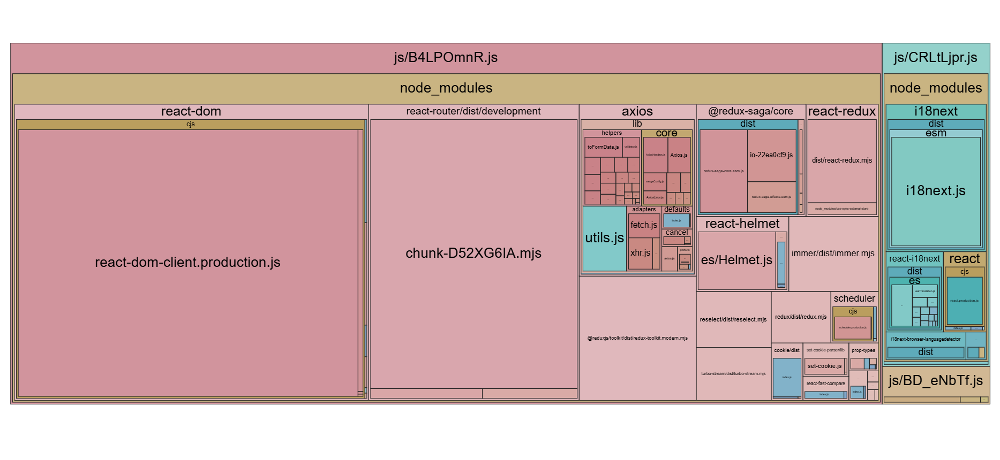

# React.js Project Template

## 🎯 Purpose  
This template is designed for developers who want to quickly set up a React.js project with minimal hassle. It provides a clean, lightweight, and highly optimized starting point with full TypeScript support and Sass preprocessor, Redux and more.

---

## 📸 Screenshots

### Main Screen



## ✨ Features  
- **Clean and Minimal**: No unnecessary files or configurations.  
- **Optimized Build**: Lightweight and efficient output.  
- **Fully Typed**: Comprehensive TypeScript support.  
- **Sass Preprocessor**: Flexible and powerful styling with Sass.  
- **Adaptability**: Easily adaptable to Next.js and Gatsby (tested with Gatsby).  

## 📂 Project Structure  
```plaintext
src/
├── api/           // Axios setup for API calls and middleware
├── assets/        // Icons, images, and other static assets
├── components/    // Components built using the `uikit` library
├── core/          // Application core, including pages
├── locale/        // Translations for multi-language support
├── routes/        // Router setup for page navigation
├── store/         // Redux global state, using Saga and Toolkit
├── styles/        // Global styles: resets, mixins, variables, fonts, layouts, etc.
├── uikit/         // Small UI components for building larger components
├── utils/         // Utility functions and helpers
├── vars/          // Global project variables
├── models/        // Global TypeScript types (e.g., themes, routing, etc.)
├── index.tsx      // Application entry point
└── vite-env.d.ts  // Vite environment settings with SVGR and default types
```

## 🛠️ Technologies  
This template uses the following tools and libraries:  
- **React.js**: Core framework for building UI.  
- **Redux (Toolkit, Saga)**: State management with support for side effects.  
- **TypeScript**: Strict type safety and enhanced development experience.  
- **Sass**: Preprocessor for styling.  

## ⚙️ Engine
And what's under the hood?
- **SWC**: which is faster than the usual build option  
- **Plugins**: It took several days and about a year of experience to set up the collector perfectly so that you get the minimum build at the exit!

## 🚀 Quick Start  

### Prerequisites  
- **Node.js**: Ensure you have Node.js (v20.17.x) installed.  

### Installation  
1. Clone the repository:  
   ```bash
   git clone <repository-url>
   cd <project-directory>
   ```
2. Install dependencies:  
   ```bash
   npm install
   ```
3. Run the development server:  
   ```bash
   npm run dev
   ```

### Building for Production  
To build the project for production, run:  
```bash
npm run build
```

## 💡 Key Highlights  

### `uikit`  
A collection of small, reusable components to streamline development of larger components.  

### `store`  
Includes Redux Toolkit setup with Saga for handling complex side effects.  

### `styles`  
Global styles directory with:  
- **Reset and Default CSS**  
- **Mixins and Variables**  
- **Fonts and Layout Helpers**  

### `locale`  
Built-in support for localization and multi-language setups.  

### Fully Customizable  
Easily extendable for advanced configurations or integrations with frameworks like Next.js or Gatsby.  

## 📜 Code Standards  
- **Strict TypeScript usage**: All code should be typed.  
- **JSDoc Documentation**: Follow JSDoc format for documenting components and utilities.  
- **Folder Structure**: Maintain the provided structure for consistency and readability.  

## 🙎️ Author / Contacts

If you have any questions, feel free to reach out:

- **Email**: d_maksimyk@vk.com
- **Telegram**: https://t.me/d_maximyuk
- **GitHub**: https://github.com/dmaximyuk

## 📄 License  
This template is publicly available for any use.  
Feel free to use, modify, and share it!  
